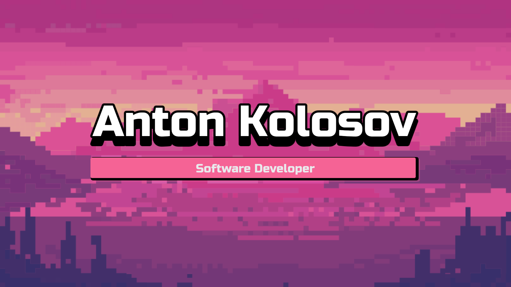

# How it's going! My name is:

 

### :man_technologist: About me:

I am a trainee-level software developer. My journey started in May 2023. The first course that I started was [Harvard's CS50P](https://cs50.harvard.edu/python/2022/) by David J. Malan.
In addition, I started my studies at [St. Petersburg's Technical College](https://sptcol.ru/) for a bachelor's degree in "Information systems and programming" program.

**Currently continuing my college course and also self-studying.**

In my self-studying, I prefer to **implement basic technologies from scratch**, without any side-party libraries.

On my Web Development road, I chose backend development and already learned some technologies:

